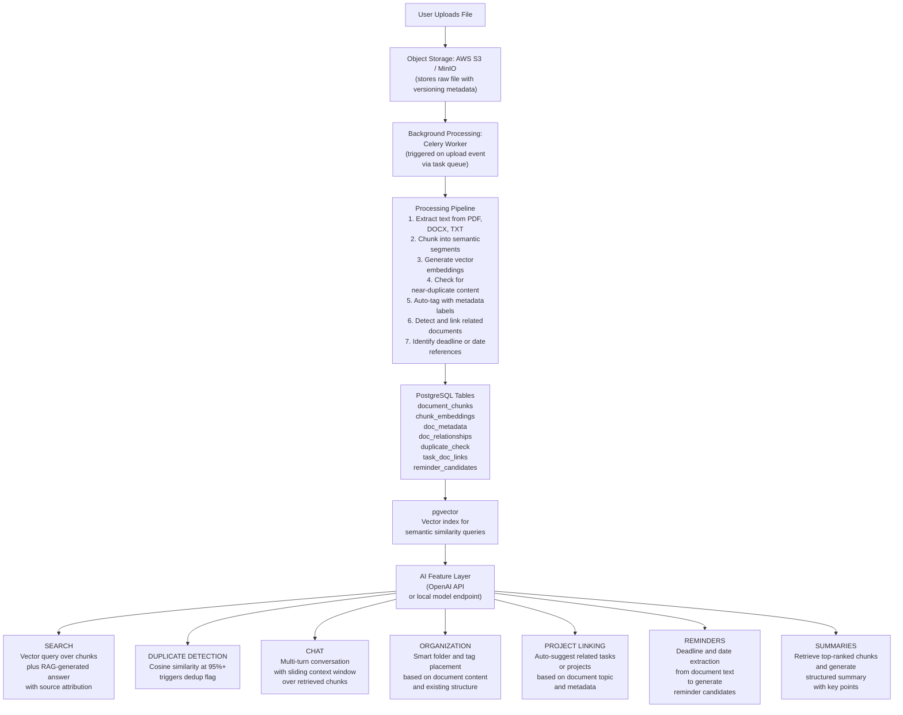

| Component | What It Is | Current Role in Ada | Expanded Role |
|---|---|---|---|
| pgvector | PostgreSQL extension for storing and querying vector embeddings | Semantic search over document chunks for RAG | Powers duplicate detection via cosine similarity, smart organization by topic, contextual reminder matching, task suggestions, and multi-turn conversation context retrieval |
| AWS S3 / MinIO | S3-compatible object storage backend | Store raw uploaded files | Store raw files with versioning support; enable rollback and deduplication tracking; maintain file relationship metadata for linked documents |
| Celery with Redis | Distributed task queue for background processing | Could automate processing pipelines | Orchestrate the full ingestion pipeline: extract text, chunk content, generate embeddings, detect duplicates, auto-organize, apply tags, and link to tasks asynchronously |
| PostgreSQL | Primary relational database | Stores user records, file metadata, and task data | Now requires additional tables for deduplication tracking, document relationship graphs, embedding metadata, task-to-document links, and reminder candidates extracted from document content |